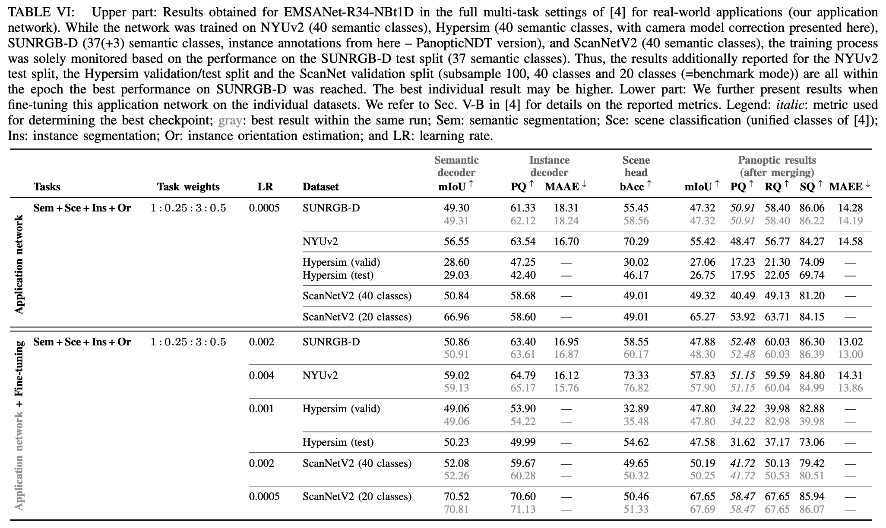

# Trained models for PanopticNDT

## Mapping experiments
See [here](../README.md#mapping-experiments) for details.

To reproduce the results reported in our paper, follow the instructions given 
[here](../README.md#reproduce-reported-emsanet-results).

## Application network and fine-tuned application network


See [here](../README.md#application-network) and [here](../README.md#fine-tuned-application-network)
for details.

To reprocduce the results reported in our paper, run:
```bash
# requires prepared datasets: NYUv2, SUNRGBD, Hypersim, and ScanNet
./evaluate_application_networks.bash
```

> We refer to the documentation of our [nicr-scene-analysis-datasets python package](https://github.com/TUI-NICR/nicr-scene-analysis-datasets/tree/v0.7.0/) for preparing the datasets.

> Use `--instances-version panopticndt` when preparing the SUNRGB-D dataset 
  with nicr-scene-analysis-datasets to reproduce reported results.
